---
## Front matter
lang: ru-RU
title: Отчет по лабораторной работе №1"
subtitle: Установка и конфигурация операционной системы на виртуальную машину
author:
  - Городяснкий Ф.Н.
institute:
  - Российский университет дружбы народов, Москва, Россия
  
date: 16 февраля 2024

## i18n babel
babel-lang: russian
babel-otherlangs: english

## Formatting pdf
toc: false
toc-title: Содержание
slide_level: 2
aspectratio: 169
section-titles: true
theme: metropolis
header-includes:
 - \metroset{progressbar=frametitle,sectionpage=progressbar,numbering=fraction}
 - '\makeatletter'
 - '\beamer@ignorenonframefalse'
 - '\makeatother'
---

# Информация

## Докладчик

:::::::::::::: {.columns align=center}
::: {.column width="70%"}

  * Городянский Фёдор Николаевич
  * студент ФФМиЕН
  * Российский университет дружбы народов
  
  * <https://github.com/Fedass>

:::
::::::::::::::

# Элементы презентации

## Цели и задачи

Целью данной работы является приобретение практических навыков установки операционной системы на виртуальную машину, настройки минимально необходимых для дальнейшей работы сервисов.

Задача - установка rocky и вывод информации в терминале. 

## Создал новую виртаульную машину.
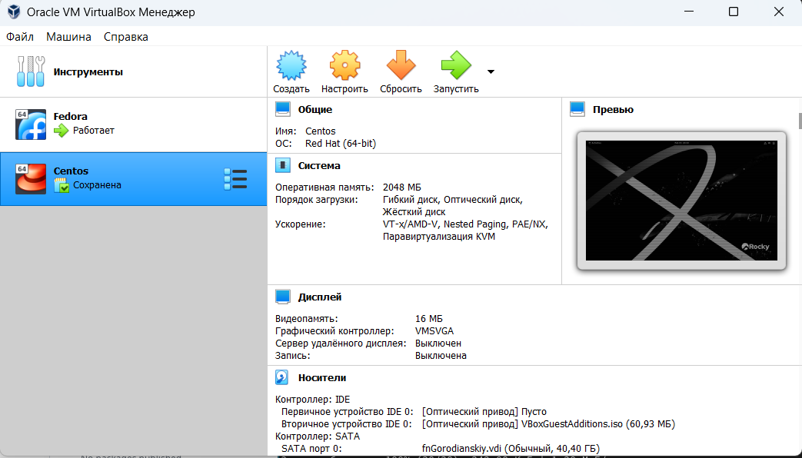{#fig:001 width=70%}

## Указал имя виртуальной машины, тип операционной системы — Linux, RedHat (64-bit), объем и тип диска, формат хранения,  имя и размер хранения.
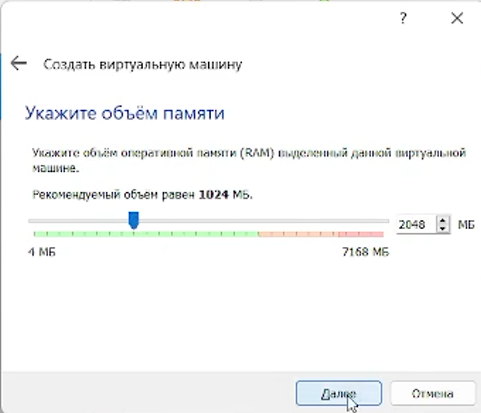{#fig:002 width=70%}
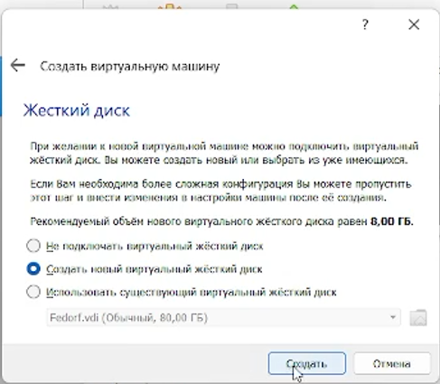{#fig:003 width=70%}
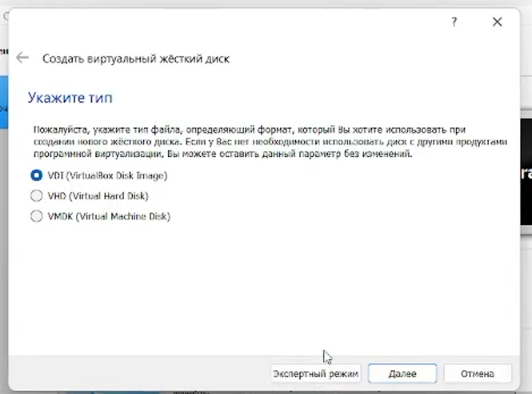{#fig:004 width=70%}
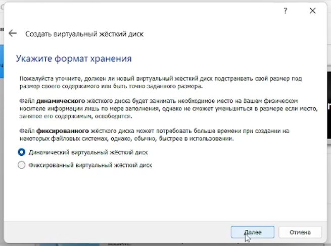{#fig:005 width=70%}
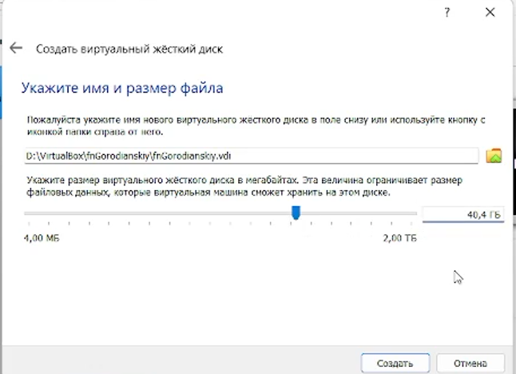{#fig:006 width=70%}

## Настройка rocky.
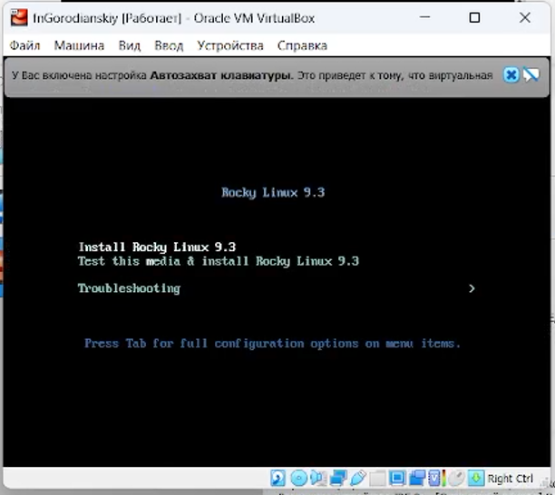{#fig:007 width=70%}

## Выбор языка.
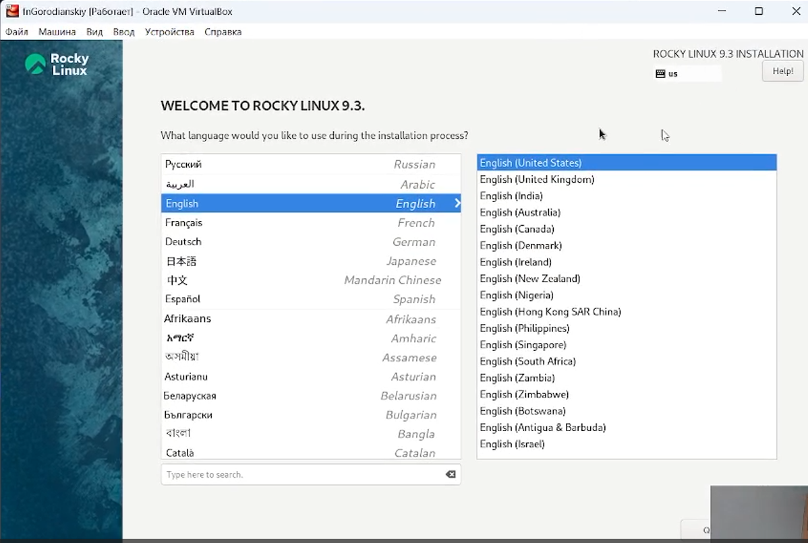{#fig:008 width=70%}

## Выбор загрузочного пространства.
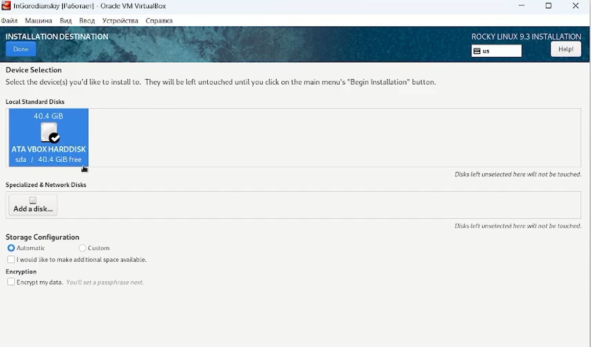{#fig:009 width=70%}

## Настройка пароля и логина.
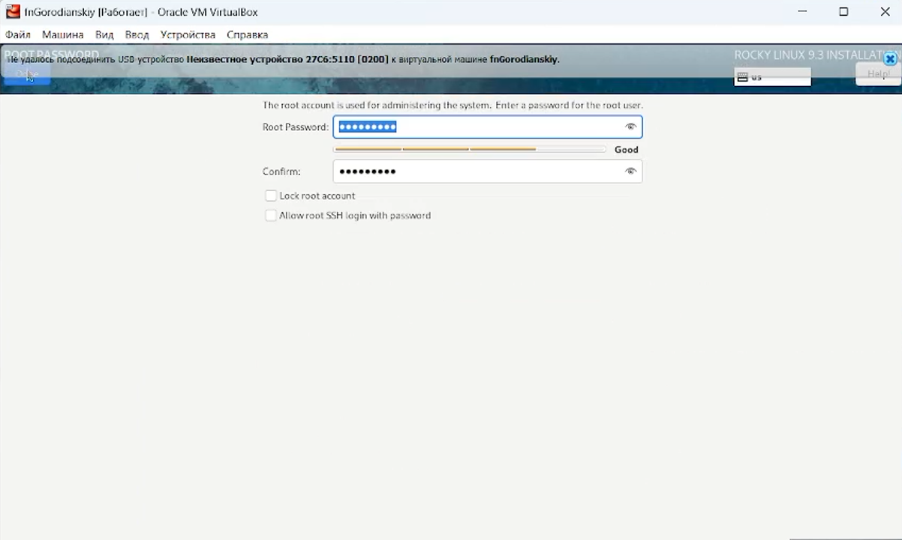{#fig:010 width=70%}

## Конец настройки.
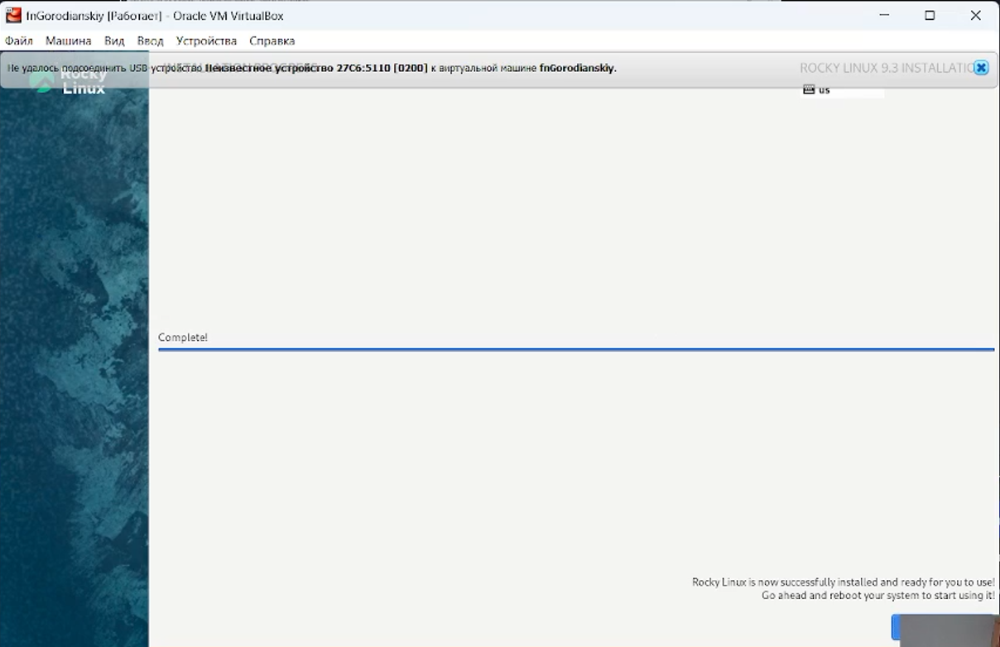{#fig:011 width=70%}
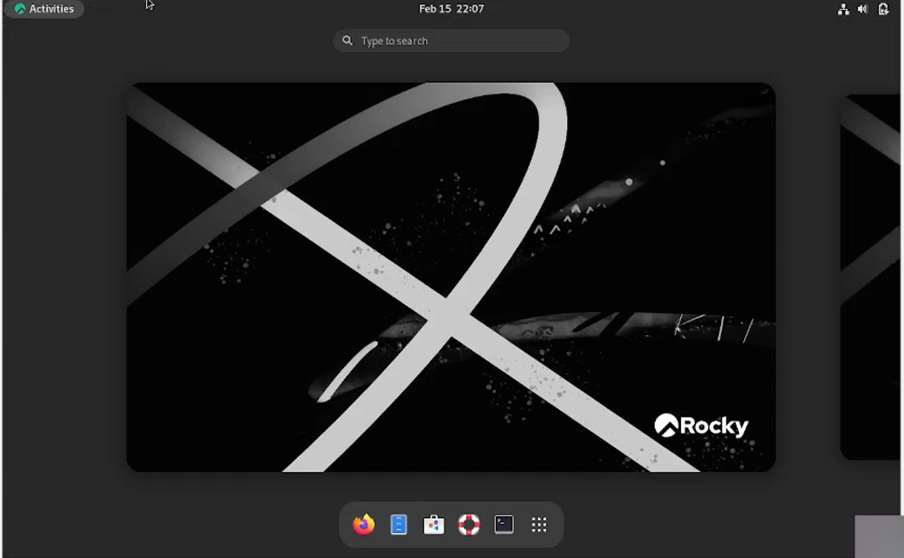{#fig:012 width=70%}

## Вывод общей информации.
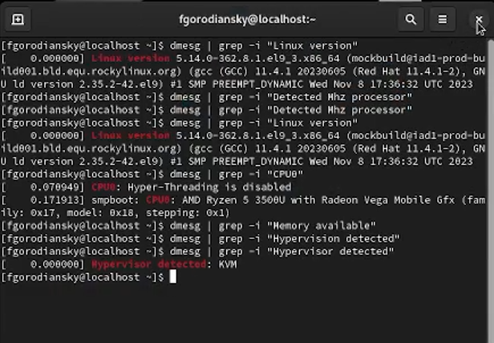{#fig:013 width=70%}

## Результаты

В результате работы я настроил дистрибутив rocky и вывел базовую информацию в терминале.

