---
## Front matter
lang: ru-RU
title: Отчёт по лабораторной работе №2
subtitle: Дискреционное разграничение прав в Linux. Основные атрибуты
author:
  - Городянский Ф.Н.
institute:
  - Российский университет дружбы народов, Москва, Россия
date: 01 марта 2024

## i18n babel
babel-lang: russian
babel-otherlangs: english

## Formatting pdf
toc: false
toc-title: Содержание
slide_level: 2
aspectratio: 169
section-titles: true
theme: metropolis
header-includes:
 - \metroset{progressbar=frametitle,sectionpage=progressbar,numbering=fraction}
 - '\makeatletter'
 - '\beamer@ignorenonframefalse'
 - '\makeatother'
---

# Информация

## Докладчик

:::::::::::::: {.columns align=center}
::: {.column width="70%"}

  * Городянский Фёдор Николаевич
  * студент фФМиЕН
  * Российский университет дружбы народов

:::
::: {.column width="30%"}

:::
::::::::::::::

# Элементы презентации

## Цели и задачи

Получение практических навыков работы в консоли с атрибутами файлов, закрепление теоретических основ дискреционного разграничени доступа в современных системах с открытым кодом на базе ОС Linux.

## B установленной при выполнении предыдущей лабораторной работы операционной системе создайте учётную запись пользователя guest (использую учётную запись администратора)

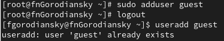
## Задайте пароль для пользователя guest (использую учётную запись администратора):
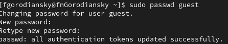

## Bойдите в систему от имени пользователя guest.
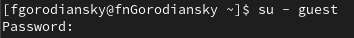

## Oпределите директорию, в которой вы находитесь, командой pwd. Сравните её с приглашением командной строки. Определите, является ли она вашей домашней директорией? Если нет, зайдите в домашнюю директорию.
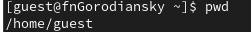

## Уточните имя вашего пользователя командой whoami.
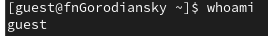

##Уточните имя вашего пользователя, его группу, а также группы, куда входит пользователь, командой id. Выведенные значения uid, gid и др. запомните. Сравните вывод id с выводом команды groups.
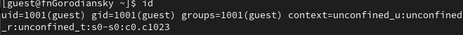

## Просмотрите файл /etc/passwd командой cat /etc/passwd.Найдите в нём свою учётную запись. Определите uid пользователя. Определите gid пользователя. Сравните найденные значения с полученными в предыдущих пунктах
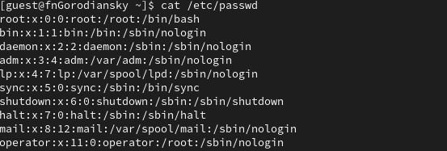

## Oпределите существующие в системе директории командой ls -l /home/ Удалось ли вам получить список поддиректорий директории /home? Какие права установлены на директориях?
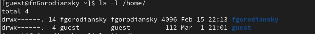

## Проверьте, какие расширенные атрибуты установлены на поддиректориях, находящихся в директории /home, командой: lsattr /home. Удалось ли вам увидеть расширенные атрибуты директории? Удалось ли вам увидеть расширенные атрибуты директорий других пользователей?
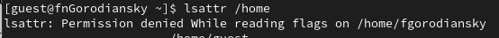

## Создайте в домашней директории поддиректорию dir1 командой mkdir dir1. Определите командами: ls -l и lsattr, какие права доступа и расширенные атрибуты были выставлены на директорию dir1.  Снимите с директории dir1 все атрибуты командой: chmod 000 dir1 и проверьте с её помощью правильность выполнения команды: ls -l.
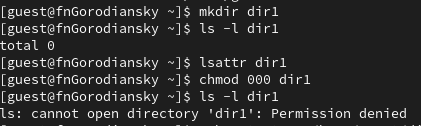

## Попытайтесь создать в директории dir1 файл file1 командой: echo "test" > /home/guest/dir1/file1 Объясните, почему вы получили отказ в выполнении операции по созданию файла? Оцените, как сообщение об ошибке отразилось на создании файла? 
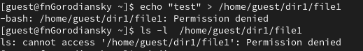

## Hа основании заполненной таблицы определите те или иные минимально необходимые права для выполнения операций внутри директории dir1, заполните табл. 2.2.
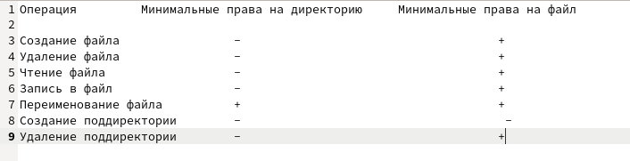

## Результаты

В итоге научился использовать атрибуты в консоли линукс Rocky.

