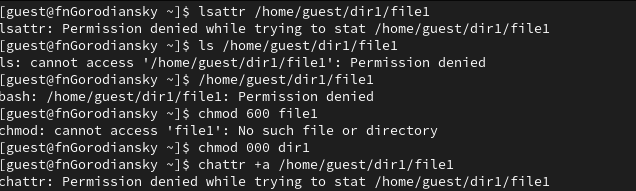
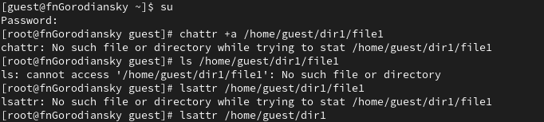
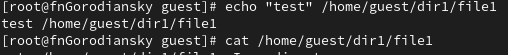
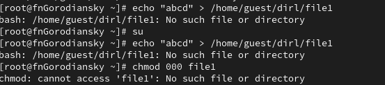
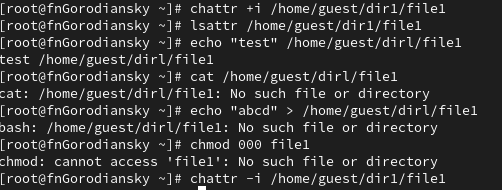

---
## Front matter
lang: ru-RU
title: Отчёт по лабораторной работе №4
subtitle: Дискреционное разграничение прав в Linux. Расширенные атрибуты
author:
  - Городянский Ф.Н.
institute:
  - Российский университет дружбы народов, Москва, Россия
  
date: 29 марта 2024

## i18n babel
babel-lang: russian
babel-otherlangs: english

## Formatting pdf
toc: false
toc-title: Содержание
slide_level: 2
aspectratio: 169
section-titles: true
theme: metropolis
header-includes:
 - \metroset{progressbar=frametitle,sectionpage=progressbar,numbering=fraction}
 - '\makeatletter'
 - '\beamer@ignorenonframefalse'
 - '\makeatother'
---

# Информация

## Докладчик

:::::::::::::: {.columns align=center}
::: {.column width="70%"}

  * Городянский Фёдор Николаевич
  * студент фФМиЕН
  * Российский университет дружбы народов
  * <https://yamadharma.github.io/ru/>

:::
::: {.column width="30%"}

# Элементы презентации

## Цели и задачи

Получение практических навыков работы в консоли с расширенными атрибутами файлов.

## Содержание исследования
1. От имени пользователя guest определите расширенные атрибуты файла
/home/guest/dir1/file1 командой
lsattr /home/guest/dir1/file1
2. Установите командой
chmod 600 file1
на файл file1 права, разрешающие чтение и запись для владельца фай-
ла.
3. Попробуйте установить на файл /home/guest/dir1/file1 расширен-
ный атрибут a от имени пользователя guest:
chattr +a /home/guest/dir1/file1 
{#fig:001 width=70%}

## Зайдите на третью консоль с правами администратора либо повысьте свои права с помощью команды su. Попробуйте установить расширенный атрибут a на файл /home/guest/dir1/file1 от имени суперпользователя:
5. От пользователя guest проверьте правильность установления атрибута:
lsattr /home/guest/dir1/file1
{#fig:001 width=70%}

## Выполните дозапись в файл file1 слова «test» командой echo "test" /home/guest/dir1/file1 После этого выполните чтение файла file1 командой cat /home/guest/dir1/file1 Убедитесь, что слово test было успешно записано в file1.
{#fig:001 width=70%}

## Попробуйте удалить файл file1 либо стереть имеющуюся в нём информацию командой echo "abcd" > /home/guest/dirl/file1
8. Попробуйте с помощью команды
chmod 000 file1
установить на файл file1 права, например, запрещающие чтение и за-
пись для владельца файла. Удалось ли вам успешно выполнить указан-
ные команды?
{#fig:001 width=70%}

## Снимите расширенный атрибут a с файла /home/guest/dirl/file1 отимени суперпользователя командой chattr -a /home/guest/dir1/file1
{#fig:001 width=70%}

## Повторите ваши действия по шагам, заменив атрибут «a» атрибутом «i». Удалось ли вам дозаписать информацию в файл? Ваши наблюдения занесите в отчёт.
{#fig:001 width=70%}

## Результаты

- Не нужны все результаты
- Необходимы логические связки между слайдами
- Необходимо показать понимание материала

## Итоговый слайд

- Запоминается последняя фраза. © Штирлиц
- Главное сообщение, которое вы хотите донести до слушателей
- Избегайте использовать последний слайд вида *Спасибо за внимание*

# Рекомендации

## Принцип 10/20/30

  - 10 слайдов
  - 20 минут на доклад
  - 30 кегль шрифта

## Связь слайдов

::: incremental

- Один слайд --- одна мысль
- Нельзя ссылаться на объекты, находящиеся на предыдущих слайдах (например, на формулы)
- Каждый слайд должен иметь заголовок

:::

## Количество сущностей

::: incremental

- Человек может одновременно помнить $7 \pm 2$ элемента
- При размещении информации на слайде старайтесь чтобы в сумме слайд содержал не более 5 элементов
- Можно группировать элементы так, чтобы визуально было не более 5 групп

:::

## Общие рекомендации

::: incremental

- На слайд выносится та информация, которая без зрительной опоры воспринимается хуже
- Слайды должны дополнять или обобщать содержание выступления или его частей, а не дублировать его
- Информация на слайдах должна быть изложена кратко, чётко и хорошо структурирована
- Слайд не должен быть перегружен графическими изображениями и текстом
- Не злоупотребляйте анимацией и переходами

:::

## Представление данных

::: incremental

- Лучше представить в виде схемы
- Менее оптимально представить в виде рисунка, графика, таблицы
- Текст используется, если все предыдущие способы отображения информации не подошли

:::

