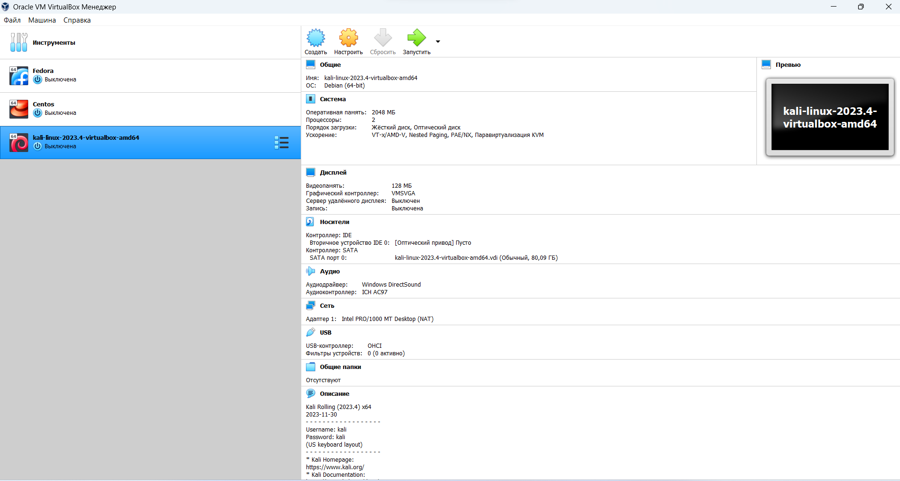
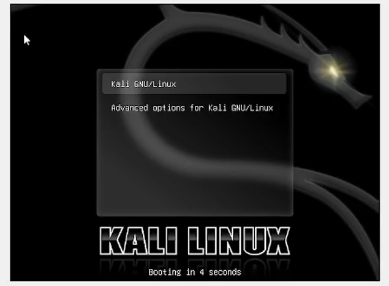
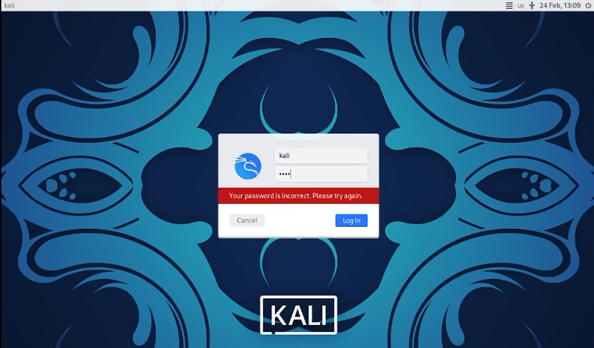
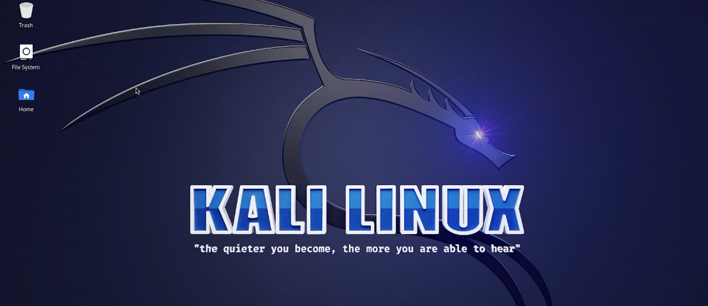

---
## Front matter
lang: ru-RU
title: Отчёт по 1 этапу и.п.
subtitle: Установка kali
author:
  - Городянский Ф.Н.
institute:
  - Российский университет дружбы народов, Москва, Россия
  - Объединённый институт ядерных исследований, Дубна, Россия
date: 24 февраля 2024

## i18n babel
babel-lang: russian
babel-otherlangs: english

## Formatting pdf
toc: false
toc-title: Содержание
slide_level: 2
aspectratio: 169
section-titles: true
theme: metropolis
header-includes:
 - \metroset{progressbar=frametitle,sectionpage=progressbar,numbering=fraction}
 - '\makeatletter'
 - '\beamer@ignorenonframefalse'
 - '\makeatother'
---

# Информация

## Докладчик

:::::::::::::: {.columns align=center}
::: {.column width="70%"}

  * Городянский Фёдор Николаевич
  * студент фФМиЕН
  * Российский университет дружбы народов
  * <https://Fedass.github.io/ru/>

:::
::: {.column width="30%"}

:::
::::::::::::::

# Элементы презентации

## Цели и задачи

Цель - научиться основным способам тестирования веб приложений.
Задание - Установите дистрибутив Kali Linux в виртуальную машину.

## Скачал образ kali.
{#fig:001 width=70%}

## Настройка системы.
{#fig:002 width=70%}
{#fig:003 width=70%}

## Результат установки.
{#fig:004 width=70%}

## Результаты

В результате готовая система kali.

