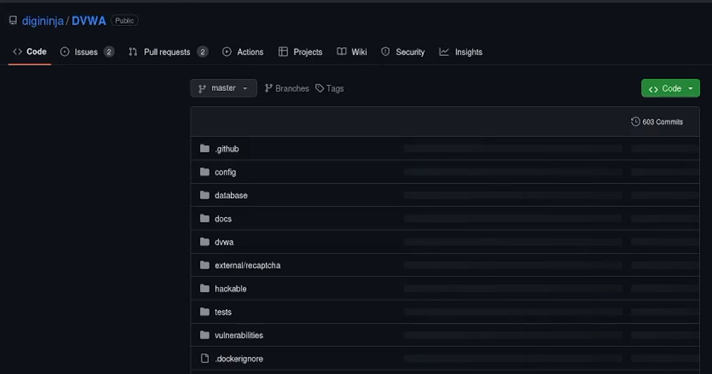
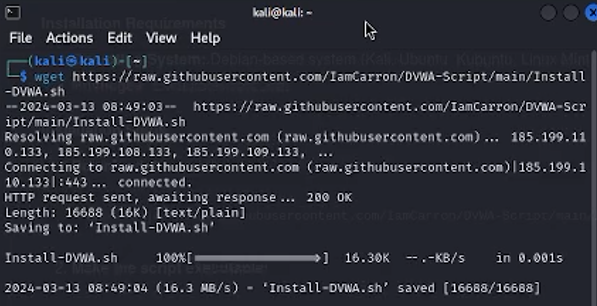
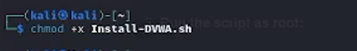
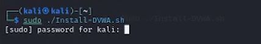
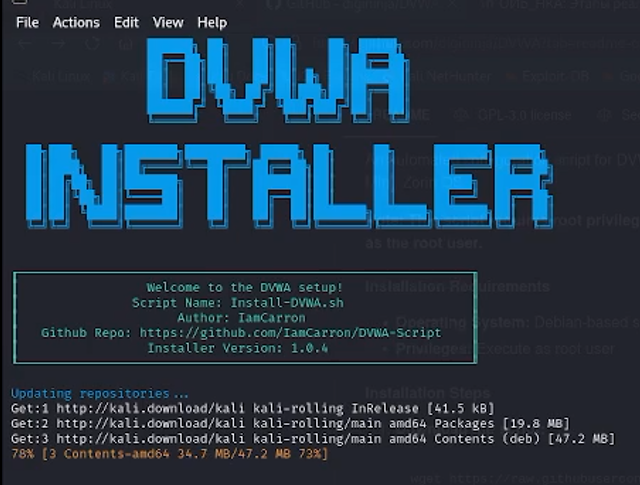
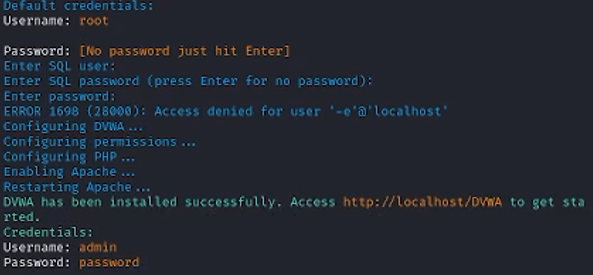

---
## Front matter
lang: ru-RU
title: Отчет по 2 этапу ип.
subtitle: Установка DVWA
author:
  - Городянский Ф.Н.
institute:
  - Российский университет дружбы народов, Москва, Россия
date: 13 марта 2024

## i18n babel
babel-lang: russian
babel-otherlangs: english

## Formatting pdf
toc: false
toc-title: Содержание
slide_level: 2
aspectratio: 169
section-titles: true
theme: metropolis
header-includes:
 - \metroset{progressbar=frametitle,sectionpage=progressbar,numbering=fraction}
 - '\makeatletter'
 - '\beamer@ignorenonframefalse'
 - '\makeatother'
---

# Информация

## Докладчик

  * Городянский Фёдор Николаевич
  * студент  фФМиЕН
  * Российский университет дружбы народов
  * <https://yamadharma.github.io/ru/>

# Элементы презентации

## Цели и задачи

Установка и настройка программы DVWA.

## Перещел в репозиторий загрузчика.
{#fig:001 width=70%}
## Установил программу.
{#fig:001 width=70%}
## Сделал программу исполняемой.
{#fig:001 width=70%}
## Запустил на правах пользователя.
{#fig:001 width=70%}
{#fig:001 width=70%}
## Установка с настройкой выполнены.
{#fig:001 width=70%}

## Результаты

В результате установлена программа DVWA.

