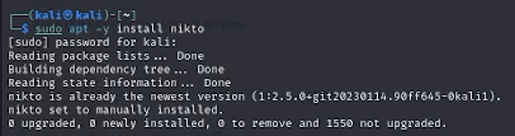
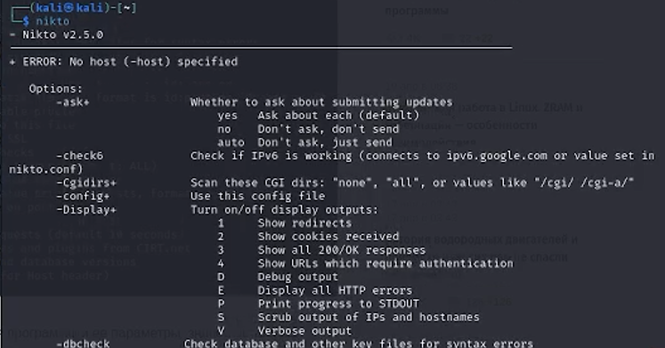
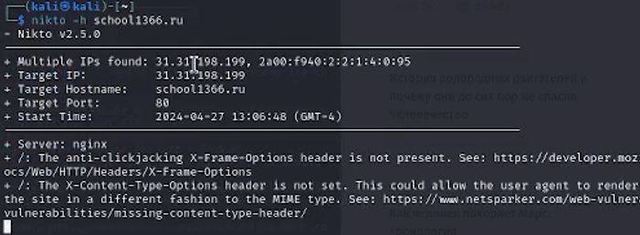
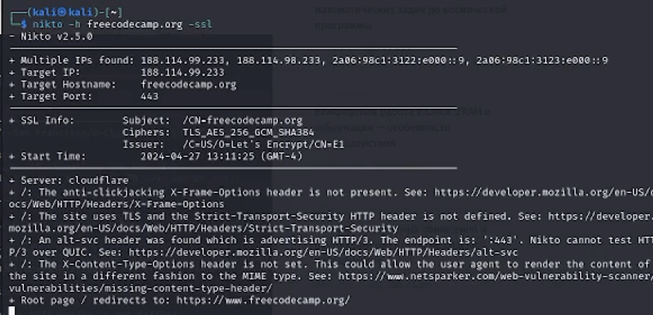

---
## Front matter
lang: ru-RU
title: Отчёт по 4 этапу индивидуального проекта
subtitle: Примение программы Nikto
author:
  - Городянский Ф.Н.
institute:
  - Российский университет дружбы народов, Москва, Россия
  
date: 27 апреля 2024

## i18n babel
babel-lang: russian
babel-otherlangs: english

## Formatting pdf
toc: false
toc-title: Содержание
slide_level: 2
aspectratio: 169
section-titles: true
theme: metropolis
header-includes:
 - \metroset{progressbar=frametitle,sectionpage=progressbar,numbering=fraction}
 - '\makeatletter'
 - '\beamer@ignorenonframefalse'
 - '\makeatother'
---

# Информация

## Докладчик

:::::::::::::: {.columns align=center}
::: {.column width="70%"}

  * Городянский Фёдор Николаевич
  * студент фФМиЕН
  * Российский университет дружбы народов
  * <https://yamadharma.github.io/ru/>

:::
::: {.column width="30%"}

:::
::::::::::::::

# Элементы презентации

## Актуальность

Nikto – бесплатный (open source) сканер для поиска уязвимостей в веб-серверах. Утилита относиться к классу blackbox сканеров, т. е. сканеров, использующих стратегию сканирования методом черного ящика. Это значит, что заранее неизвестно о внутреннем устройстве программы/сайта (доступ к исходному коду отсутствует) и упор сделан на функциональность. Программа может обнаруживать более 6700 потенциально опасных файлов и уязвимостей. Новые уязвимости добавляются в базу данных программы по мере их возникновения.

Среди функций Nikto можно выделить следующие:

- поддержка SSL,
- поддержка HTTP прокси;
- создание отчетов в текстовом формате, XML, HTML, NBE или CSV;
- возможность сканирования портов;
- поиск поддоменов;
- поддержка плагинов для расширения функционала сканирования.

## Цели и задачи

Изучить программу Nikto.

## Установил Nikto.
{#fig:001 width=70%}

## Проверка корректной установки.
{#fig:001 width=70%}

## Сканирую сайт Московоской школы.
{#fig:001 width=70%}

## Сканирую заданные порты сайта.
{#fig:001 width=70%}

## Сканирование информации связанной с протоколом HTPPS сайта.
{#fig:001 width=70%}

## Результаты

Получил навыки пользования программой-сканером Nikto.

